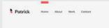

# personal_portfolia

## To Do

0) connect with git
1) find good few fonts
2) make main page attractive
3) Social media icon links to nav bar 
4) short introduction of yourself 
5) add picrture with a nice floating frame
6) attractive projects display

7) indication on with part of the page you are

8) make a resume page with a seperate resume window

9) contact info

10) english and estonian text translation'

